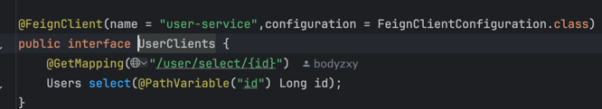
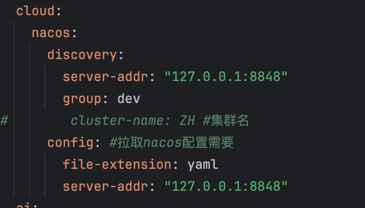
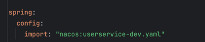
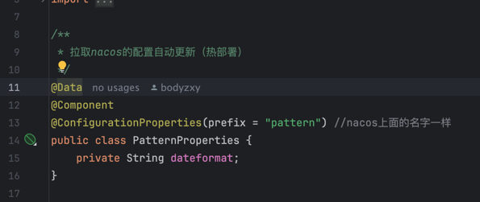
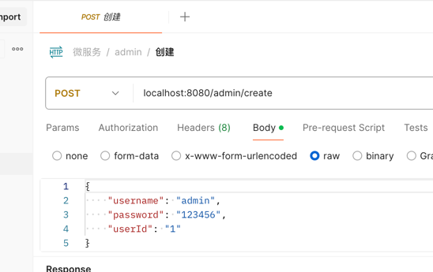
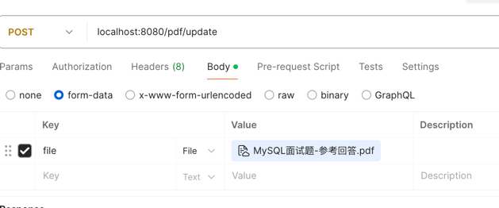
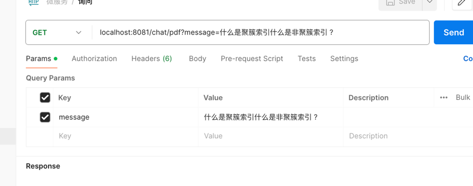
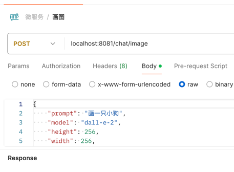
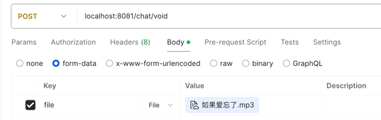

# chat-demo
本项目使用Spring Ai和Spring cloud基于Open Ai API接口的后端项目
(暂无前端)实现对文件的向量存储及问答，并且可以
实现图片的生成与音频的转录。

## 使用技术
```
Spring cloud
Spring Boot
Spring AI
Nacos
JWT
PostgreSQL
Feign
```

## Feign

引入配置
```angular2html
<dependency>
    <groupId>org.springframework.cloud</groupId>
    <artifactId>spring-cloud-starter-openfeign</artifactId>
</dependency>
```

然后创建接口连接需要的客户端的端口



## NACOS使用


首先创建进行Nacos的安装，然后在项目中进行引用
```angular2html
 <dependency>
    <groupId>com.alibaba.cloud</groupId>
    <artifactId>spring-cloud-starter-alibaba-nacos-discovery</artifactId>
</dependency>
<dependency>
    <groupId>com.alibaba.cloud</groupId>
    <artifactId>spring-cloud-starter-alibaba-nacos-config</artifactId>
</dependency>
```


然后进行相关配置



此处如果有公共的配置可以设置在nacos上面，然后需要设置config来进行拉取操作



然后可以通过配置获取nacos上面的配置并进行热部署



## JWT
引入配置
```angular2html
<dependency>
    <groupId>io.jsonwebtoken</groupId>
    <artifactId>jjwt</artifactId>
    <version>0.9.1</version>
</dependency>
```

创建`JwtUtil`类用来生成jwt和token解析
```angular2html
 /**
     * 生成jwt
     * 使用Hs256算法, 私匙使用固定秘钥
     *
     * @param secretKey jwt秘钥
     * @param ttlMillis jwt过期时间(毫秒)
     * @param claims    设置的信息
     * @return
     */
    public static String createJWT(String secretKey, long ttlMillis, Map<String, Object> claims) {
        // 指定签名的时候使用的签名算法，也就是header那部分
        SignatureAlgorithm signatureAlgorithm = SignatureAlgorithm.HS256;

        // 生成JWT的时间
        long expMillis = System.currentTimeMillis() + ttlMillis;
        Date exp = new Date(expMillis);

        // 设置jwt的body
        JwtBuilder builder = Jwts.builder()
                // 如果有私有声明，一定要先设置这个自己创建的私有的声明，这个是给builder的claim赋值，一旦写在标准的声明赋值之后，就是覆盖了那些标准的声明的
                .setClaims(claims)
                // 设置签名使用的签名算法和签名使用的秘钥
                .signWith(signatureAlgorithm, secretKey.getBytes(StandardCharsets.UTF_8))
                // 设置过期时间
                .setExpiration(exp);

        return builder.compact();
    }

    /**
     * Token解密
     *
     * @param secretKey jwt秘钥 此秘钥一定要保留好在服务端, 不能暴露出去, 否则sign就可以被伪造, 如果对接多个客户端建议改造成多个
     * @param token     加密后的token
     * @return
     */
    public static Claims parseJWT(String secretKey, String token) {
        // 得到DefaultJwtParser
        Claims claims = Jwts.parser()
                // 设置签名的秘钥
                .setSigningKey(secretKey.getBytes(StandardCharsets.UTF_8))
                // 设置需要解析的jwt
                .parseClaimsJws(token).getBody();
        return claims;
    }

```

然后自定义jwt拦截器用来拦截信息进行判断
```angular2html
 @Autowired
    private JwtProperties jwtProperties;

    @Override
    public boolean preHandle(HttpServletRequest request, HttpServletResponse response, Object handler) throws Exception {
        //判断当前拦截到的是Controller的方法还是其他资源
        if (!(handler instanceof HandlerMethod)){
            //当前拦截不是动态方法，放行
            return true;
        }
        //1.从请求头中获取令牌
        String token = request.getHeader(jwtProperties.getAdminTokenName());

        //2.校验令牌
        try {
            log.info("jwt校验token:{}", token);
            Claims claims = JwtUtil.parseJWT(jwtProperties.getAdminSecretKey(),token);
            Long empId = Long.valueOf(claims.get("empId").toString());
            log.info("员工id,empId:{}", empId);
            BaseContext.setCurrentId(empId);//将用户id存入线程
            //3.通过
            return true;
        }catch (Exception ex){
            response.setStatus(401);
            return false;
        }
    }
```

最后进行全局拦截
```angular2html
@Override
public void addInterceptors(InterceptorRegistry registry) {
    log.info("开始注册拦截器.....");
    registry.addInterceptor(jwtTokenAdminInterceptor)
        .addPathPatterns("/admin/**")
        .addPathPatterns("/pdf/**")
        .excludePathPatterns("/admin/login")
        ;
    }
```

## 管理端
主要功能注册查询和上床pdf文件






## 用户端
可以通过上传的pdf内容对数据库进行检索获取想要的答案，并且可以使用openai生成图片
和对音频的转录






